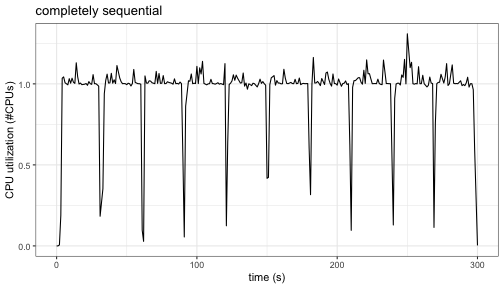
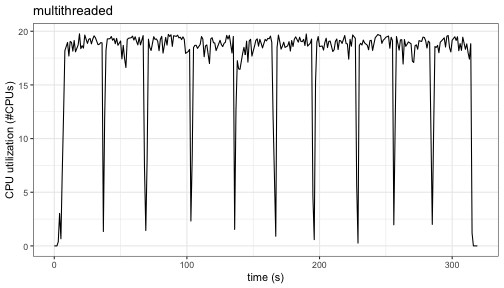
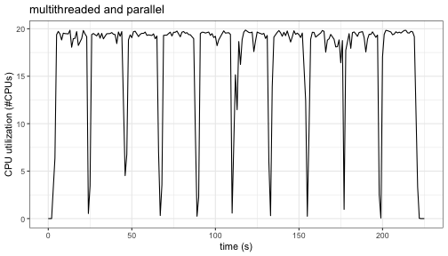
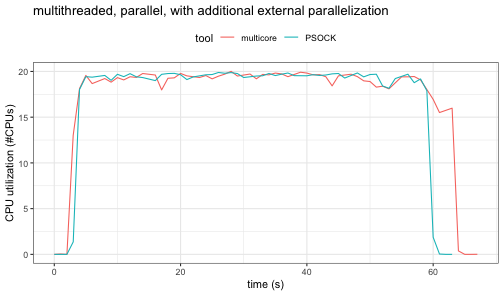

This repository looks at ways to optimally parallel process h2o when it is used with the tidymodels agua package. 

A simulated data set was tuned over a small grid of 5 candidate models and model performance was measured using 10-fold cross-validation. This means that a total of 50 models were created during tuning. 

When tuning or resampling, agua processes the data and sends computations to the h2o server in chunks based on the data set. In other words, if there are 10 data sets (from 10-fold cross-validation), agua sends all of the grid configurations to the h2o server at the same time. In essence, the 50 models are processed in chunks of 10.

The computer is an iMacPro with 10 Intel chips running R version 4.2.0 (2022-04-22). The [Syrupy](https://github.com/jeetsukumaran/Syrupy) python library was used to monitor CPU usage. 

## Computational methods

The computations were run in a few different ways: 

* __Completely sequential processing__. The idea was to have the h2o server use a single thread to process the models. The file `sequential.R` used `h2o.init(nthreads = 1)` to do this. Implicitly, `h2o.grid()` has a default that models are processed sequentially. 

* __Multithreaded processing__: The server was configured to use all CPUs on the host via `h2o.init(nthreads = -1)` while `h2o.grid()` is still set to sequential processing. This code is in `multithreaded.R`. 

* __Multithreaded parallel processing__: Along with `h2o.init(nthreads = -1)`, the calls to the h2o server used `h2o.grid(parallelism = 5)` so that a maximum of 5 models (i.e. the entire grid) could be processed at once. 

* __Multithreaded, multicore parallel processing__: Along with `h2o.init(nthreads = -1)`, the calls to the h2o server used `h2o.grid(parallelism = 50)`. In additional, multicore parallel processing via the foreach and doMC packages were used to send all of the candidate models for all resamples to the server at once. 

* __Multithreaded, PSOCK parallel processing__: Along with `h2o.init(nthreads = -1)`, the calls to the h2o server used `h2o.grid(parallelism = 50)`. In additional, multicore parallel processing via the foreach and doParallel packages were used to send all of the candidate models for all resamples to the server at once. 


## Results


When the baseline configuration of single threaded, sequential processing was used the execution time for the grid search was 296.6 seconds. The pattern of CPU usage was:



The 10 clusters of high utilization correspond to the h2o server processing the 5 candidate models for each of the 10 resamples. CPU utilization is about 1, as expected. 

Once multiple threads were allowed, the grid search lasted 311 seconds (slightly slower than the baseline). Looking at the `Rout` file, the output lists that

```
    H2O cluster total cores:    20 
    H2O cluster allowed cores:  20 
```

so it is unclear why the processing was relatively slow. The usage graph: 



All 20 possible (logical) cores are being used. 

Once we allow the h2o server to train multiple models at once, the grid search lasted 218.5 seconds (a 1.4-fold speed-up): 




Once we used the foreach package to send all the jobs to the h2o server at once, there was an drop in execution time: 62.9 seconds for muticore and 63.3 seconds using a PSOCK cluster. These correspond to speed-ups of 63.3-fold. 

The CPU utilization for both external parallelization methods show constant utilization since all 50 models are being continually processed: 




